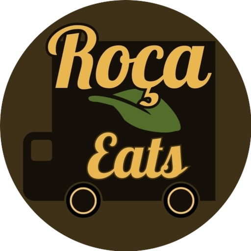
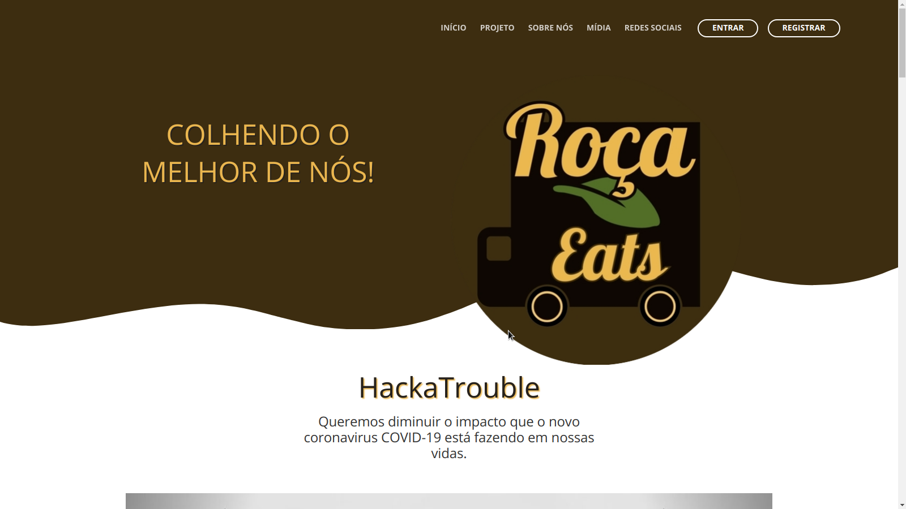

<p align="center">
<a href="https://rocaeats.org/">
  
 </a>
</p>

<p align="center">
  <a href="https://github.com/hpbonfim/roca-eats#readme">
    
  </a>

  <a href="https://github.com/hpbonfim/roca-eats#readme">
    
  </a>

  <a href="https://github.com/hpbonfim/roca-eats#readme">
    
  </a>

  <a href="https://github.com/hpbonfim/roca-eats/commits/master">
    
  </a>

  <a href="https://github.com/hpbonfim/roca-eats#readme">
    
  </a>

  <a href="https://github.com/hpbonfim/roca-eats/graphs/commit-activity">
    
  </a>
</p>


Projeto desenvolvido em Ionic. 
Criado especialmente para o HackaTrouble https://www.hackatrouble.com.br/

Plataforma Roça Eats visa **reaproveitar os frutos de colheitas** que por conta da crise do coronavirus, não foi realizada a venda e **doar para instituições de caridade, ajudando o meio ambiente** e garantindo a **equidade alimentícia.**


# Ferramentas Utilizadas

### FRONT-END:
* **[Ionic](https://ionicframework.com/)** - Cross Plataform - Usado para criar o app mobile.
* **[Angular](https://angular.io/)** - PWA - Usado para criar o HTML no estilo PWA *(Progressive Web App)*.
*  **[Angular Material](https://material.angular.io/)** - Componentes modernos de UI *(Design de interface de usuário)* para Angular.
* **[Font Awesome](https://fontawesome.com/)** - Banco de Ícones Pagos/Gratuitos


### BACK-END:

* **[NodeJS](https://nodejs.org/en/)** - JavaScript Runtime I/O assíncrono orientado a eventos.
* **[Docker](https://www.docker.com/)** - Plataforma de código aberto para criação de ambientes isolados via container.
* **[Express](https://expressjs.com/)** - Framework utilizado para criar APIs.
* **[MongooseJS](https://mongoosejs.com/)** - Elegante script para criar conexões com [MongoDB](https://www.mongodb.com/) .
* **[MongoDB](https://www.mongodb.com/)** - Software de banco de dados orientado a documentos, de código aberto e multiplataforma.
 

## Instalação

#### Front-end requer [Node.js](https://nodejs.org/) v10+ para ser executado.

Instale as dependências and devDependencies antes de iniciar.

```sh
$ cd app
$ npm ou yarn install
$ npm install @angular/cli
$ ng serve
```
#### Back-end requer [Node.js](https://nodejs.org/) v12+ para ser executado.

Instale as dependências and devDependencies antes de iniciar.

```sh
$ cd api
$ npm install
$ node start
```
##### Navegue pelo aplicativo:
    Endereço: http://localhost:4200/

## Produção


#### requer **[Docker](https://www.docker.com/)** e uma conta no [Docker Hub](https://hub.docker.com/) para colocar em produção.


```sh
$ cd api
$ docker build . -t roca/app:latest
$ docker run roca/app:latest
```


```sh
$ cd app
$ docker build . -t roca/api:latest
$ docker run -d -p 3000:3000 --restart="always" roca/api:latest
```

##### Navegue pelo aplicativo:
    Endereço: http://127.0.0.1/

<p align="center">
 <a href="https://github.com/hpbonfim/roca-eats/graphs/commit-activity">
    
  </a>
</p>

License
----

**Open Source, be my guest!!** 


